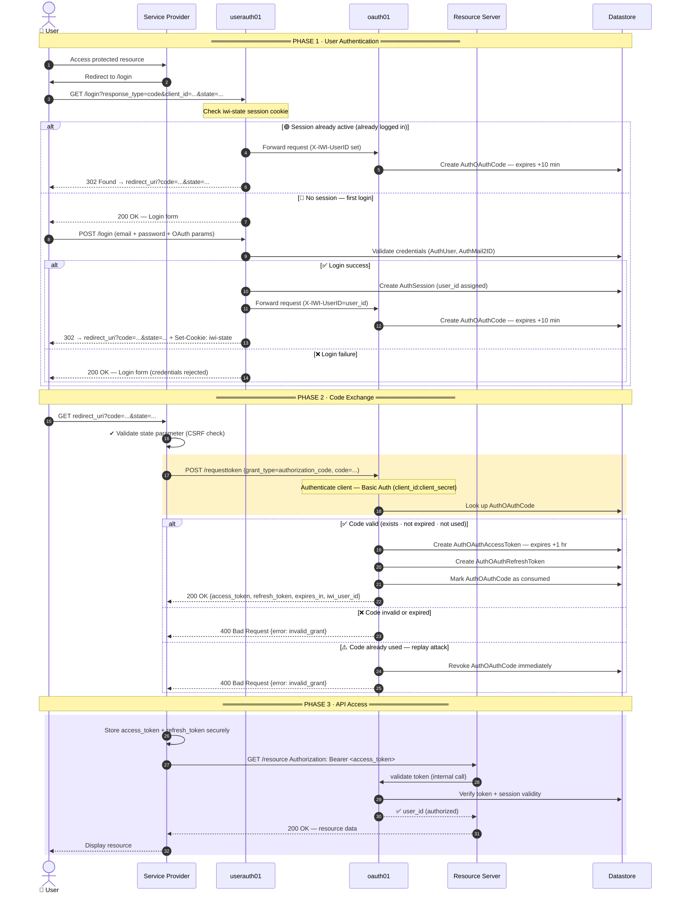
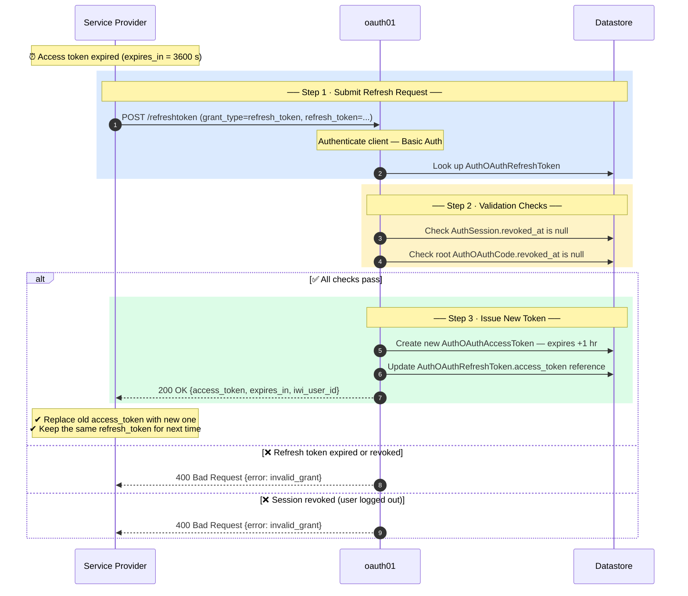
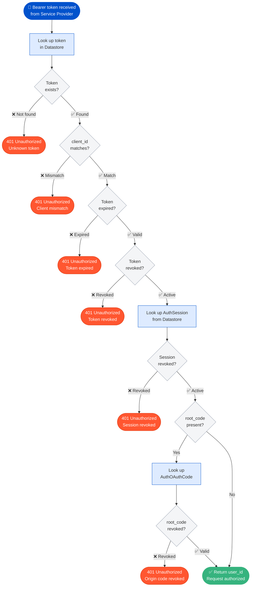
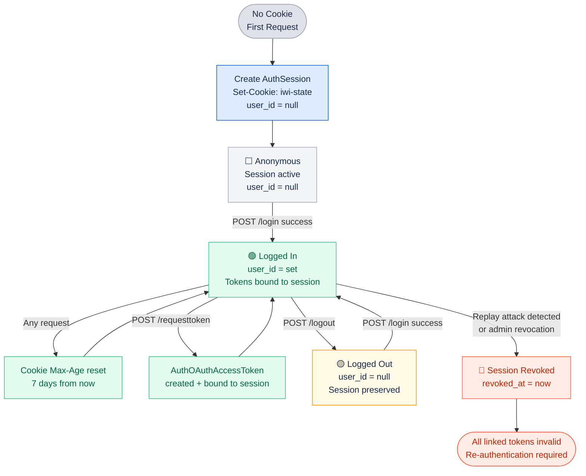
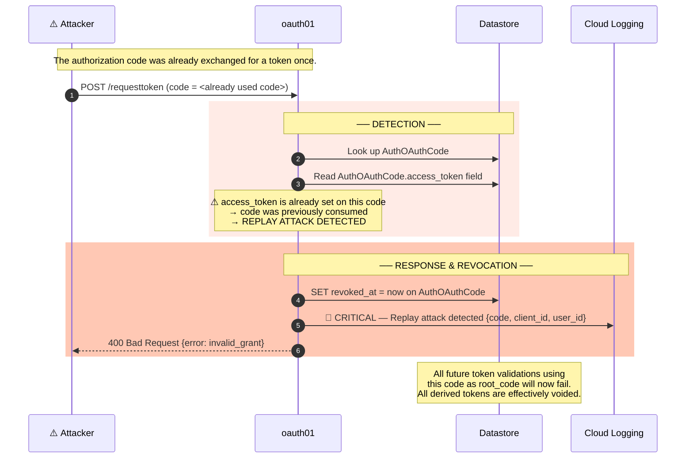

[← Back to Index](../README.md)

# oauth01 Service — Flow Diagrams

**Service:** PJ_IWI_RECONS  
**Standard:** RFC 6749 — OAuth 2.0 Authorization Code Grant

---

## Table of Contents

- [Overview](#overview)
- [Full Authorization Code Grant Flow](#full-authorization-code-grant-flow)
- [Token Refresh Flow](#token-refresh-flow)
- [Token Validation Flow (Resource Server Side)](#token-validation-flow-resource-server-side)
- [Session Lifecycle](#session-lifecycle)
- [Security Event Flow — Replay Attack Detection](#security-event-flow--replay-attack-detection)
- [Token Expiry Timeline](#token-expiry-timeline)

---

## Overview

The oauth01 service implements the OAuth 2.0 Authorization Code Grant (RFC 6749 §4.1). It sits between the user's browser, the client application (Service Provider), and protected resource servers.

| Actor | Role |
|-------|------|
| **User (Browser)** | End user operating a web browser |
| **Service Provider** | Client application requesting access on behalf of the user |
| **userauth01** | Handles user login / authentication (user-facing) |
| **oauth01** | This service — issues authorization codes and tokens |
| **Resource Server** | Downstream IWI service that validates access tokens |
| **Cloud Datastore** | Persistent storage for sessions, codes, and tokens |

---

## Full Authorization Code Grant Flow

The flow is divided into three phases: **User Authentication**, **Code Exchange**, and **API Access**.

---

## Token Refresh Flow

When the access token expires, the Service Provider uses the refresh token to obtain a new access token — no user interaction required.

> **Note:** The refresh response does **not** include a new `refresh_token`. Keep using the same one.

---

## Token Validation Flow (Resource Server Side)

This flowchart shows every check the `oauth_guard` module runs when a Resource Server validates a Bearer token. All six checks must pass — the first failure returns `401 Unauthorized`.

---

## Session Lifecycle

The `iwi-state` cookie tracks the user's session state. Each state has distinct behavior for token operations.

| State | Color | user_id | Tokens valid? |
|-------|-------|---------|---------------|
| Anonymous | ⬜ Gray | `null` | — |
| Logged In | 🟢 Green | set | Yes |
| Logged Out | 🟡 Yellow | `null` | Existing tokens invalid on next check |
| Revoked | 🔴 Red | — | No — all tokens rejected immediately |

---

## Security Event Flow — Replay Attack Detection

If a client attempts to reuse an authorization code that was already exchanged, the service treats it as a replay attack, revokes the code immediately, and logs a `CRITICAL` event.

---

## Token Expiry Timeline

| Token | Lifetime | Notes |
|-------|----------|-------|
| **Authorization Code** | 10 minutes | Single-use. Reusing it triggers replay attack detection and immediate revocation. |
| **Access Token** | 1 hour (3600 s) | Passed as `Authorization: Bearer <token>` on every API call. |
| **Refresh Token** | Long-lived | 60-second reuse window for concurrent requests. Same token reused for all future refreshes. |
| **Session Cookie** (`iwi-state`) | 7 days | Max-Age is reset to 7 days on every active request. |

```mermaid
gantt
    title Token Lifetime Overview (minutes)
    dateFormat  X
    axisFormat  %s min

    section Auth Code
    Valid — 10 min         : 0, 10

    section Access Token
    Valid — 60 min         : 0, 60

    section Refresh Token
    Reuse window — 1 min   : crit, 0, 1
    Long-lived             : 1, 60

    section Session Cookie
    Active — refreshed per request (shown as 60 min) : active, 0, 60
```

---

*Reference: RFC 6749 — The OAuth 2.0 Authorization Framework*  
*© Funai Soken Digital — IWI Documentation*
