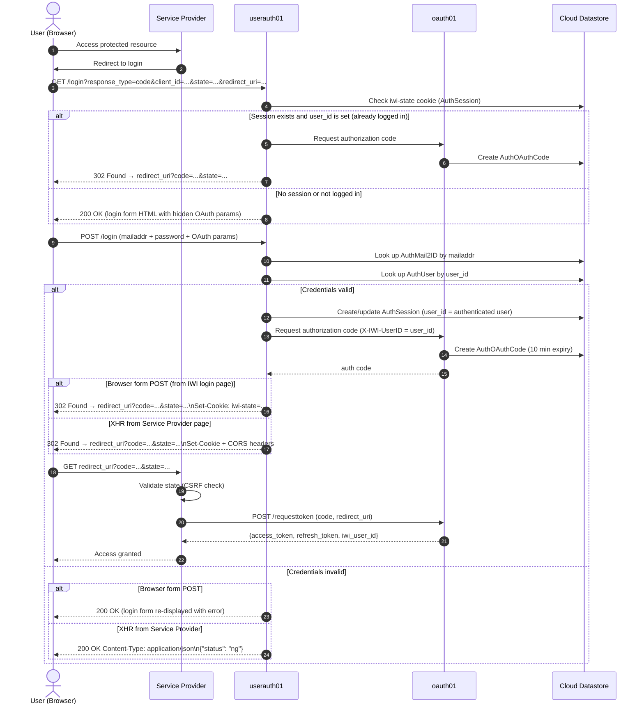
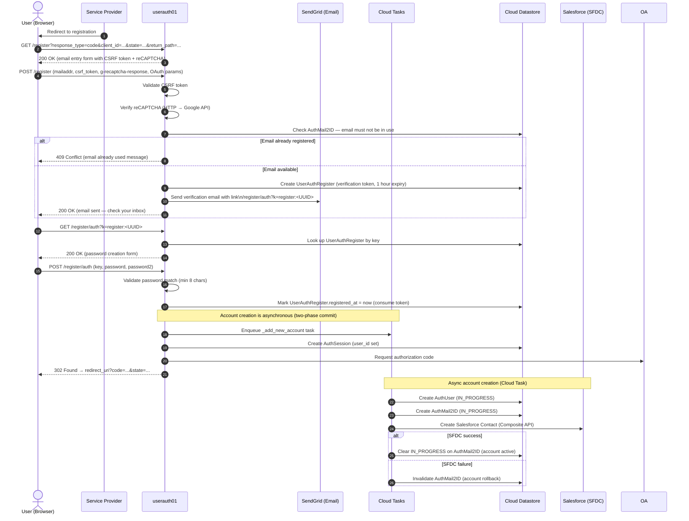
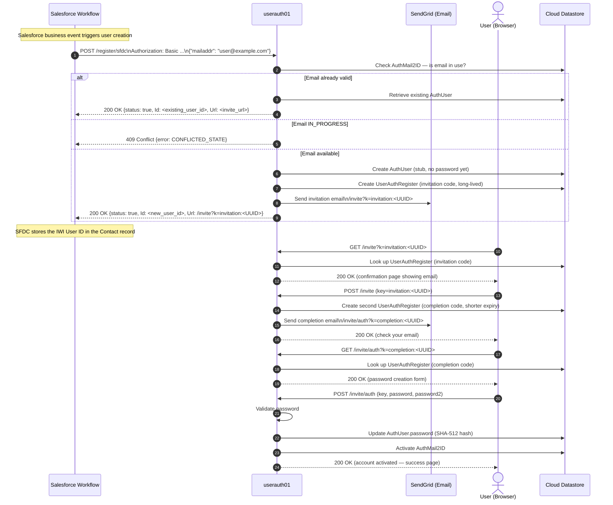
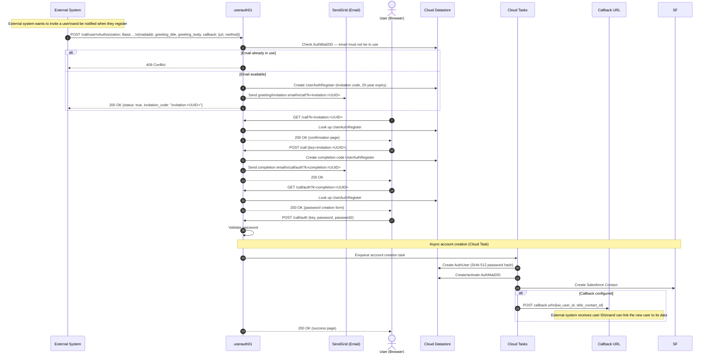
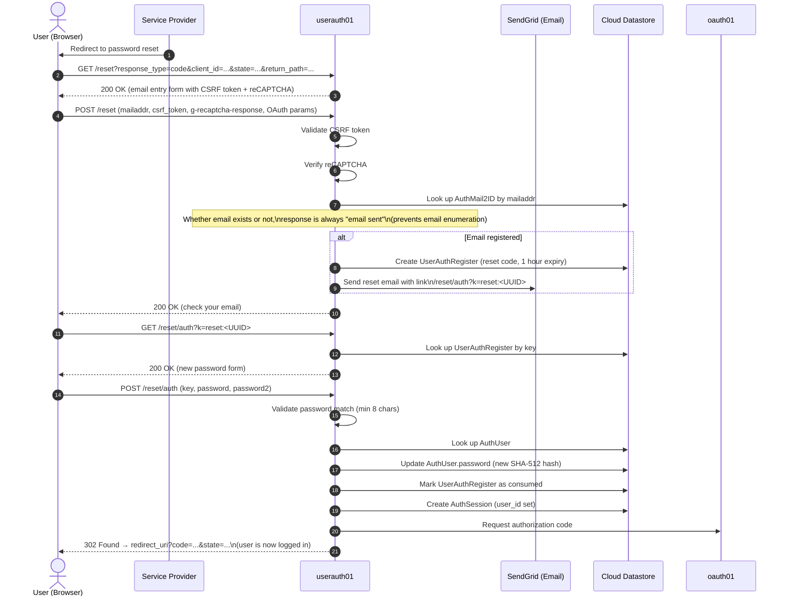
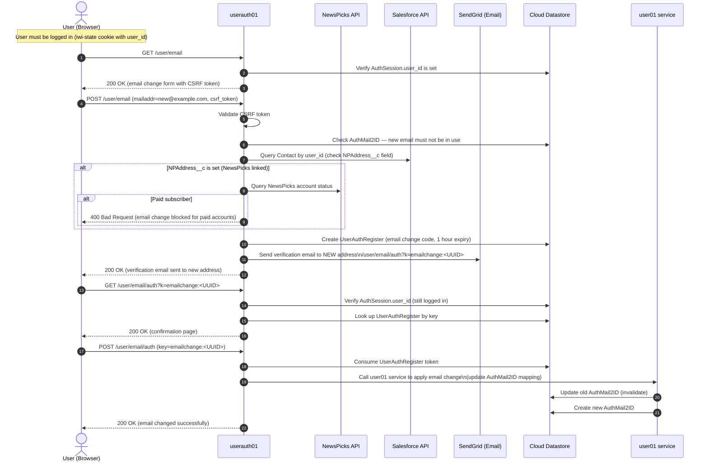
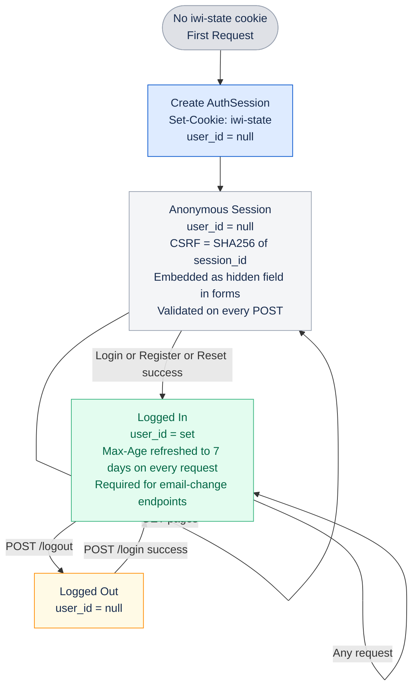
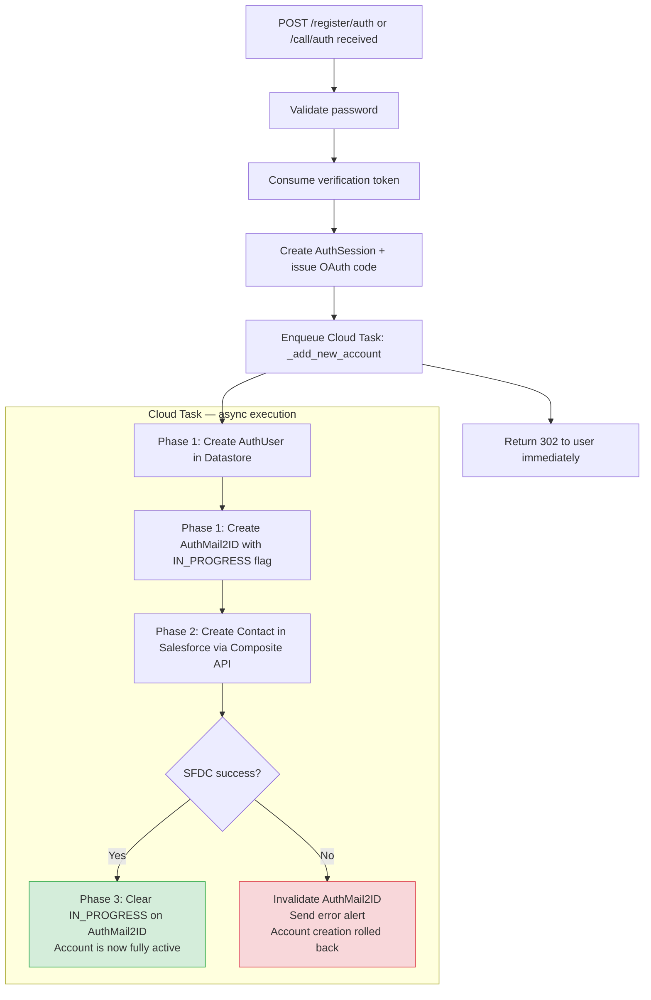
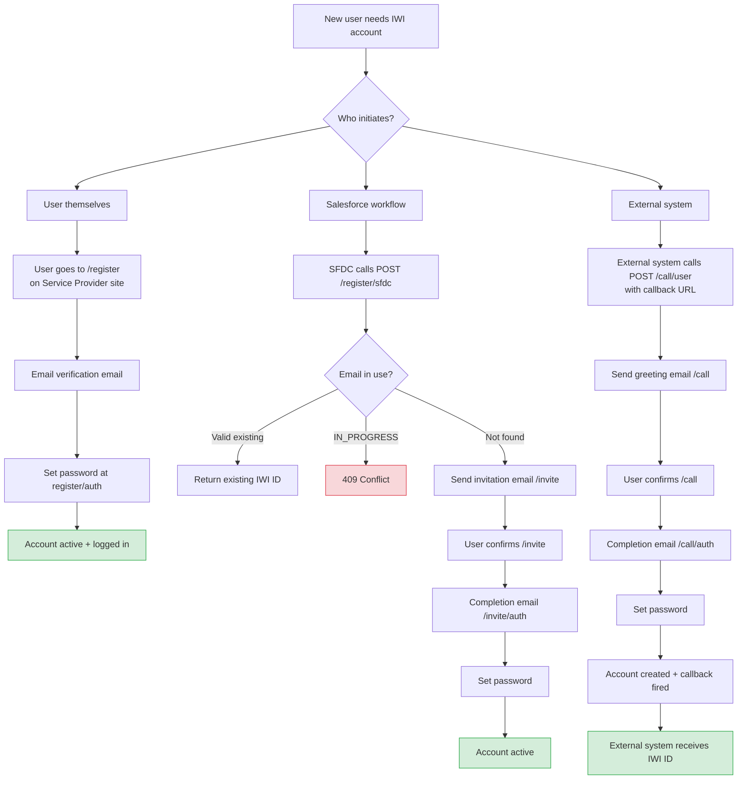

[← Back to Index](../README.md)

# userauth01 Service — Flow Diagrams

**Service:** PJ_IWI_USERAUTH  
**Service Name:** userauth01  
**Standard:** RFC 6749 — OAuth 2.0 Authorization Code Grant (user-facing flows)

---

## Table of Contents

- [Overview](#overview)
- [Login Flow](#login-flow)
- [User-Initiated Registration Flow](#user-initiated-registration-flow)
- [SFDC-Initiated Invitation Flow](#sfdc-initiated-invitation-flow)
- [Call-Based Invitation Flow](#call-based-invitation-flow)
- [Password Reset Flow](#password-reset-flow)
- [Email Change Flow](#email-change-flow)
- [Session and CSRF State Diagram](#session-and-csrf-state-diagram)
- [Account Activation — Async Two-Phase Commit](#account-activation--async-two-phase-commit)

---

## Overview

The userauth01 service is the **user-facing authentication gateway** for the IWI platform. It bridges the end user (browser), the Service Provider (client application), and the oauth01 authorization service. All successful authentication flows ultimately result in an OAuth 2.0 Authorization Code being delivered to the Service Provider.

**Actors:**

| Actor | Description |
|-------|-------------|
| User (Browser) | End user with a web browser |
| Service Provider | Client application integrating with IWI |
| userauth01 | This service — handles login, registration, password reset |
| oauth01 | OAuth 2.0 token service — issues authorization codes and tokens |
| Salesforce (SFDC) | CRM — Contact records created for new users |
| SendGrid | Email delivery service |
| Cloud Tasks | Async task queue for account creation callbacks |
| Cloud Datastore | Storage for sessions, users, and verification tokens |

---

## Login Flow

The login flow handles two modes: **browser form** (from IWI's own login page) and **XHR** (from a Service Provider's own page using JavaScript).

**Note on legacy passwords:** If an account was migrated from HeartCore (MD5 hash), the password is automatically re-hashed to SHA-512 on the first successful login.

---

## User-Initiated Registration Flow

New users register themselves by providing their email address and setting a password.

---

## SFDC-Initiated Invitation Flow

An external Salesforce workflow creates an IWI account on behalf of a user. The user is then invited to set their password.

---

## Call-Based Invitation Flow

An alternative invitation flow for external systems that need a callback notification after the user completes registration.

---

## Password Reset Flow

Users who forgot their password can reset it via their registered email address.

---

## Email Change Flow

Authenticated users can change their primary email address. The flow verifies the new address and blocks changes for paid NewsPicks subscribers.

---

## Session and CSRF State Diagram

---

## Account Activation — Async Two-Phase Commit

New account creation uses a Cloud Tasks-based two-phase commit to ensure consistency between the IWI Datastore and Salesforce.

**Why async?** Salesforce API calls can take several seconds. By creating the IWI session and issuing the OAuth code immediately, the user is never blocked waiting for Salesforce. The account is functional for authentication within milliseconds.

---

## Registration Flow Decision Tree

---

*© Funai Soken Digital — IWI Documentation*
